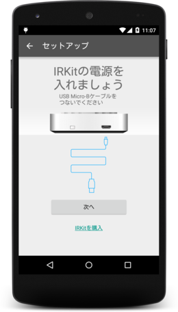
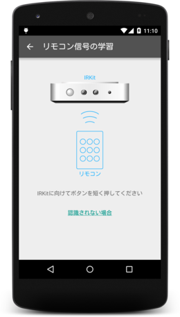
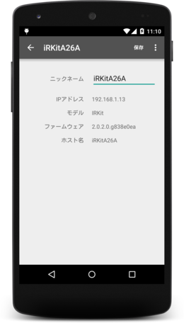

IRKitの機能をAndroidアプリに組み込むためのSDKです。

## 機能

- IRKitのセットアップ
- リモコン信号の学習
- リモコン信号の送信

## 目次

- [ダウンロード](#download-ja)
- [apikeyをセットする](#apikey-ja)
- [クラスの概要](#classes-ja)
- [SDKを組み込む](#setup-sdk-ja)
- [赤外線信号を受信する](#receiving-signal-ja)
- [保存済みのIRKitデバイス一覧を取得する](#get-irperipherals-ja)
- [保存済みの赤外線信号一覧を取得する](#get-irsignals-ja)
- [赤外線信号を送信する](#sending-signal-ja)
- [新しいIRKitをセットアップする](#setup-irkit-ja)
- [Activityの使い方](#activities-ja)
  - [IRKitSetupActivity](#irkitsetupactivity-ja)
  - [WaitSignalActivity](#waitsignalactivity-ja)
  - [SignalActivity](#signalactivity-ja)
  - [DeviceActivity](#deviceactivity-ja)
  - [見た目を変更する](#changing-activity-style)
- [IRKitデバイス発見イベントを受け取る](#receiving-events-ja)
- [HTTP APIを直接使う](#http-api)
  - [Device HTTP APIの利用可否](#device-http-api-availability)
  - [Internet HTTP API](#internet-http-api)
  - [Device HTTP API](#device-http-api)
- [Javadoc](http://irkit.github.io/android-sdk/javadoc/)
- [サンプルコード](#sample-ja)
- [サンプルアプリの動かし方](#sample-app-ja)
- [バージョンごとの変更点](CHANGELOG.md)

### ダウンロード

Android Studioをお使いの場合、モジュールのbuild.gradleの`dependencies`内に以下の1行を追加してください。

    compile 'com.getirkit:irkit-android-sdk:1.1.2'

### apikeyをセットする

apikeyは開発時に一度だけ取得してアプリに埋め込みます。AndroidManifest.xmlの`<application>`内に以下の`<meta-data>`を追加して、`YOUR_API_KEY`を取得したapikeyに置き換えてください。

    <meta-data android:name="com.getirkit.IRKIT_API_KEY" android:value="YOUR_API_KEY" />

apikeyの取得方法は[POST /1/apps](http://getirkit.com/#IRKit-Internet-POST-1-apps)を参照してください。curlコマンドが利用できない場合は、[Postman](https://chrome.google.com/webstore/detail/postman-rest-client-packa/fhbjgbiflinjbdggehcddcbncdddomop)（Chrome）や[Poster](https://addons.mozilla.org/ja/firefox/addon/poster/)（Firefox）などのブラウザ拡張機能を利用してapikeyを取得できます。  
[Postmanでの実行例](https://raw.githubusercontent.com/irkit/android-sdk/master/images/postman.png)  
Posterでの実行例：[手順1](https://raw.githubusercontent.com/irkit/android-sdk/master/images/poster-1.png) [手順2](https://raw.githubusercontent.com/irkit/android-sdk/master/images/poster-2.png)

### クラスの概要

クラス                               | 役割
------------------------------------ | -------------------------------
com.getirkit.irkit.IRKit             | SDKの基本クラス
com.getirkit.irkit.IRSignal          | 1つの赤外線信号を表す
com.getirkit.irkit.IRSignals         | IRSignalを格納するArrayList
com.getirkit.irkit.IRPeripheral      | 1つのIRKitデバイスを表す
com.getirkit.irkit.IRPeripherals     | IRPeripheralを格納するArrayList
com.getirkit.irkit.net.IRHTTPClient  | HTTP APIを直接扱うためのクラス

IRHTTPClientはDevice HTTP APIやInternet HTTP APIを直接扱いたい場合に利用しますが、IRKitクラスにはより手軽に利用できるメソッドが用意されていますので、通常はIRHTTPClientを使う必要はありません。

### SDKを組み込む

SDKの基本となるIRKitインスタンスは`IRKit.sharedInstance()`で取得できます。IRKit SDKを使用するActivityのonCreate()内で以下のようにinit()を呼んでSDKを初期化（有効化）します。

    @Override
    protected void onCreate(Bundle savedInstanceState) {
        super.onCreate(savedInstanceState);

        ...

        // ContextをセットしてSDKを初期化する。すでに初期化済みの場合は
        // Contextのセットのみ行われる。
        IRKit.sharedInstance().init(getApplicationContext());
    }

init()は初回呼び出し時のみデータ読み込みなどの初期化を行うため、複数のActivityに上記のようにinit()を入れて問題ありません。

ActivityのonResume()とonPause()に以下のコードを追加します。

    @Override
    protected void onResume() {
        super.onResume();

        IRKit irkit = IRKit.sharedInstance();

        // ローカルネットワーク内のIRKit検索を開始
        irkit.startServiceDiscovery();

        // Wi-Fi接続状態の変化を監視して、Wi-Fiが有効になった際に
        // IRKit検索を開始し、Wi-Fiが無効になった際に検索を停止する
        irkit.registerWifiStateChangeListener();

        // clientkeyを取得していない場合は取得する
        irkit.registerClient();
    }

    @Override
    protected void onPause() {
        super.onPause();

        IRKit irkit = IRKit.sharedInstance();

        // ローカルネットワーク内のIRKit検索を停止
        irkit.stopServiceDiscovery();

        // Wi-Fi状態の変化の監視をやめる
        irkit.unregisterWifiStateChangeListener();
    }

SDKはローカルネットワーク内にIRKitを発見すると自動的にdeviceidの取得などの初期設定を内部で行います。

### 赤外線信号を受信する

[WaitSignalActivity](#waitsignalactivity-ja)を起動するか、または以下のようにwaitForSignal()を使って赤外線信号を受信します。

    // IRHTTPClientインスタンスを取得
    IRHTTPClient httpClient = IRKit.sharedInstance().getHTTPClient();

    // 赤外線信号を受信する。第2引数にtrueを指定すると、
    // 前回の赤外線信号を消去して新しい赤外線信号を待機する。
    httpClient.waitForSignal(new IRAPICallback<IRInternetAPIService.GetMessagesResponse>() {
        @Override
        public void success(IRInternetAPIService.GetMessagesResponse getMessagesResponse, Response response) {
            // 信号の受信に成功した

            // 受信した信号を保存する例
            IRSignals signals = IRKit.sharedInstance().signals;
            IRSignal signal = new IRSignal();
            signal.setId(signals.getNewId());
            signal.setDeviceId(getMessagesResponse.deviceid);
            signal.setFrequency((float) getMessagesResponse.message.freq);
            signal.setFormat(getMessagesResponse.message.format);
            signal.setData(getMessagesResponse.message.data);
            signals.add(signal);
            signals.save();
        }

        @Override
        public void failure(RetrofitError error) {
            // エラー
        }
    }, true);

waitForSignal()を使わずにInternet HTTP APIを直接使いたい場合は以下のようにします。

    // Internet HTTP API
    IRInternetAPIService internetAPI = IRKit.sharedInstance().getHTTPClient().getInternetAPIService();

    // リクエストパラメータを作成
    HashMap<String, String> params = new HashMap<>();
    params.put("clientkey", "XXXXXXXXXXXXXXXXXXXXXXXXXXXXXXXX");
    params.put("clear", "1");

    // GET /1/messages を呼ぶ
    internetAPI.getMessages(params, new Callback<IRInternetAPIService.GetMessagesResponse>() {
        @Override
        public void success(IRInternetAPIService.GetMessagesResponse getMessagesResponse, Response response) {
            if (getMessagesResponse != null) {
                // 信号受信成功
            } else { // レスポンスが空
                // サーバ側タイムアウト
            }
        }

        @Override
        public void failure(RetrofitError error) {
            // エラー
        }
    });

### 保存済みのIRKitデバイス一覧を取得する

    // 保存済みのIRKitデバイス一覧を取得
    IRPeripherals peripherals = IRKit.sharedInstance().peripherals;

IRPeripheralsはIRPeripheralを保持するArrayListです。

### 保存済みの赤外線信号一覧を取得する

    // 保存済みの赤外線信号一覧を取得
    IRSignals signals = IRKit.sharedInstance().signals;

IRSignalsはIRSignalを保持するArrayListです。

### 赤外線信号を送信する

まず、送信する赤外線信号を表すIRSignalインスタンスを何らかの方法で取得します。

    // 保存済みのIRSignalインスタンスの1つを取得する
    IRSignal signal = IRKit.sharedInstance().signals.get(0);

あるいは手動でIRSignalインスタンスを作成することもできます。

    // 手動でIRSignalインスタンスを作成する
    IRSignal signal = new IRSignal();
    signal.setFormat("raw");
    signal.setFrequency(38.0f);
    signal.setData(new int[]{
        18031,8755,1190,1190,1190,3341,1190,3341,1190,3341,1190,1190,1190,3341,1190,3341,1190,3341,1190,3341,1190,3341,1190,3341,1190,1190,1190,1190,1190,1190,1190,1190,1190,3341,1190,3341,1190,1190,1190,3341,1190,1190,1190,1190,1190,1190,1190,1190,1190,1190,1190,1190,1190,1190,1190,1190,1190,3341,1190,3341,1190,3341,1190,3341,1190,3341,1190,65535,0,9379,18031,4400,1190
    });
    signal.setDeviceId("XXXXXXXXXXXXXXXXXXXXXXXXXXXXXXXX");

信号を送信するにはIRSignalインスタンスを引数にしてsendSignal()を呼びます。ローカルネットワーク内にIRKitを発見した場合はDevice HTTP APIを用いて送信し、そうでない場合はInternet HTTP APIで送信されます。

    // signalを送信
    IRKit.sharedInstance().sendSignal(signal, new IRAPIResult() {
        @Override
        public void onSuccess() {
            // 送信成功
        }

        @Override
        public void onError(IRAPIError error) {
            // 送信エラー
        }

        @Override
        public void onTimeout() {
            // 送信エラー（タイムアウト）
        }
    });

上記のsendSignal()を使わずにDevice HTTP APIを直接使いたい場合は以下のようにします。Device HTTP APIを使って信号を送信する場合はdeviceidは不要です。

    IRHTTPClient httpClient = IRKit.sharedInstance().getHTTPClient();

    // IRKitのIPアドレスをセット
    httpClient.setDeviceAPIEndpoint("http://192.168.1.1");

    // Device HTTP API
    IRDeviceAPIService deviceAPI = httpClient.getDeviceAPIService();

    // リクエストパラメータを作成
    IRDeviceAPIService.PostMessagesRequest req = new IRDeviceAPIService.PostMessagesRequest();
    req.format = "raw";
    req.freq = 38.0f;
    req.data = new int[] {
        18031,8755,1190,1190,1190,3341,1190,3341,1190,3341,1190,1190,1190,3341,1190,3341,1190,3341,1190,3341,1190,3341,1190,3341,1190,1190,1190,1190,1190,1190,1190,1190,1190,3341,1190,3341,1190,1190,1190,3341,1190,1190,1190,1190,1190,1190,1190,1190,1190,1190,1190,1190,1190,1190,1190,1190,1190,3341,1190,3341,1190,3341,1190,3341,1190,3341,1190,65535,0,9379,18031,4400,1190
    };

    // POST /messages を呼ぶ
    deviceAPI.postMessages(req, new Callback<IRDeviceAPIService.PostMessagesResponse>() {
        @Override
        public void success(IRDeviceAPIService.PostMessagesResponse postMessagesResponse, Response response) {
            // 送信成功
        }

        @Override
        public void failure(RetrofitError error) {
            // 送信エラー
        }
    });

Internet HTTP APIを直接使いたい場合は以下のようにします。

    // Internet HTTP API
    IRInternetAPIService internetAPI = IRKit.sharedInstance().getHTTPClient().getInternetAPIService();

    // リクエストパラメータを作成
    HashMap<String, String> params = new HashMap<>();
    params.put("clientkey", "XXXXXXXXXXXXXXXXXXXXXXXXXXXXXXXX");
    params.put("deviceid", "XXXXXXXXXXXXXXXXXXXXXXXXXXXXXXXX");
    params.put("message", "{\"format\":\"raw\",\"freq\":38,\"data\":[18031,8755,1190,1190,1190,3341,1190,3341,1190,3341,1190,1190,1190,3341,1190,3341,1190,3341,1190,3341,1190,3341,1190,3341,1190,1190,1190,1190,1190,1190,1190,1190,1190,3341,1190,3341,1190,1190,1190,3341,1190,1190,1190,1190,1190,1190,1190,1190,1190,1190,1190,1190,1190,1190,1190,1190,1190,3341,1190,3341,1190,3341,1190,3341,1190,3341,1190,65535,0,9379,18031,4400,1190]}");

    // POST /1/messages を呼ぶ
    internetAPI.postMessages(params, new Callback<IRInternetAPIService.PostMessagesResponse>() {
        @Override
        public void success(IRInternetAPIService.PostMessagesResponse postMessagesResponse, Response response) {
            // 送信成功
        }

        @Override
        public void failure(RetrofitError error) {
            // 送信失敗
        }
    });

### 新しいIRKitをセットアップする

[IRKitSetupActivity](#irkitsetupactivity-ja)を起動するとセットアップ用のUIが表示されます。IRKitSetupActivityを使わずにセットアップを行うには以下のようにします。

    // IRKitの接続先となるWi-Fi
    IRWifiInfo irWifiInfo = new IRWifiInfo();
    irWifiInfo.setSSID("home-wifi-ssid");
    irWifiInfo.setSecurity(IRWifiInfo.SECURITY_WPA_WPA2);
    irWifiInfo.setPassword("home-wifi-password");

    // IRKitのセットアップ用Wi-Fiのパスワード
    String irkitWifiPassword = "0000000000";

    // apikeyをAndroidManifest.xmlから取得する
    String apikey = IRKit.sharedInstance().getIRKitAPIKey();

    // IRKitのセットアップを開始
    IRKit.sharedInstance().setupIRKit(apikey, irWifiInfo, irkitWifiPassword, new IRKit.IRKitConnectWifiListener() {
        @Override
        public void onStatus(String status) {
            // セットアップ状況が更新された
        }

        @Override
        public void onError(String message) {
            // セットアップ失敗
        }

        @Override
        public void onComplete() {
            // セットアップ完了
        }
    });

進行中のセットアップをキャンセルするにはcancelIRKitSetup()を呼びます。

    // セットアップをキャンセルする
    IRKit.sharedInstance().cancelIRKitSetup();

### Activityの使い方

SDKには4つのActivityが含まれており、IRKitのセットアップや信号学習などのUIを簡単に組み込むことができます。

Activity                                       | 用途
---------------------------------------------- | -------------------------------
com.getirkit.irkit.activity.IRKitSetupActivity | IRKitをセットアップする
com.getirkit.irkit.activity.DeviceActivity     | IRKitデバイス詳細情報を表示・編集する
com.getirkit.irkit.activity.WaitSignalActivity | リモコン信号を学習する
com.getirkit.irkit.activity.SignalActivity     | ボタン（信号）情報を表示・編集する

まず、各Activityの処理結果を受け取るために以下のような定数を定義しておきます。

    private static final int REQUEST_IRKIT_SETUP   = 1;
    private static final int REQUEST_SIGNAL_DETAIL = 2;
    private static final int REQUEST_WAIT_SIGNAL   = 3;
    private static final int REQUEST_DEVICE_DETAIL = 4;

#### IRKitSetupActivity

IRKitSetupActivityを起動すると、IRKitのセットアップをユーザに行わせることができます。

    Intent intent = new Intent(this, IRKitSetupActivity.class);
    startActivityForResult(intent, REQUEST_IRKIT_SETUP);

セットアップが完了した場合はRESULT_OKが返ります。

    @Override
    public void onActivityResult(int requestCode, int resultCode, Intent data) {
        super.onActivityResult(requestCode, resultCode, data);

        if (requestCode == REQUEST_IRKIT_SETUP && resultCode == RESULT_OK) {
            // セットアップが完了した
        }
    }

#### WaitSignalActivity

WaitSignalActivityを起動すると、リモコン信号の学習をユーザに行わせることができます。

    Intent intent = new Intent(this, WaitSignalActivity.class);
    startActivityForResult(intent, REQUEST_WAIT_SIGNAL);

学習が完了した場合はRESULT_OKが返ります。

    @Override
    public void onActivityResult(int requestCode, int resultCode, Intent data) {
        super.onActivityResult(requestCode, resultCode, data);

        if (requestCode == REQUEST_WAIT_SIGNAL && resultCode == RESULT_OK) {
            Bundle args = data.getExtras();
            IRSignal signal = args.getParcelable("signal"); // 受信した信号
            IRKit irkit = IRKit.sharedInstance();
            signal.setId(irkit.signals.getNewId()); // ランダムなidを割り当てる

            if (signal.hasBitmapImage()) { // アイコンに写真が指定された
                // signal.renameToSuggestedImageFilename() は setId() より後に呼ぶ
                if (!signal.renameToSuggestedImageFilename(this)) {
                    // ファイル名変更失敗
                }
            } else { // アイコンリストから選択された
                // signalのimageResourceIdを元にimageResourceNameを更新する
                signal.onUpdateImageResourceId(getResources());
            }

            // ボタンのリストに追加する
            irkit.signals.add(signal);
            irkit.signals.save();
        }
    }

#### SignalActivity

学習済みのボタンの詳細情報を表示、編集、削除する画面を表示します。

    Bundle args = new Bundle();
    args.putInt("mode", SignalActivity.MODE_EDIT); // 編集モード
    args.putParcelable("signal", signal); // IRSignalインスタンスを渡す
    Intent intent = new Intent(this, SignalActivity.class);
    intent.putExtras(args);
    startActivityForResult(intent, REQUEST_SIGNAL_DETAIL);

ユーザが「保存」または「削除」を押した場合はRESULT_OKが返ります。下のコードで変数actionには、保存の場合は`save`、削除の場合は`delete`という文字列が入ります。

    @Override
    public void onActivityResult(int requestCode, int resultCode, Intent data) {
        super.onActivityResult(requestCode, resultCode, data);

        if (requestCode == REQUEST_SIGNAL_DETAIL && resultCode == RESULT_OK) {
            Bundle args = data.getExtras();
            String action = args.getString("action");
            IRSignal signal = args.getParcelable("signal");
            int mode = args.getInt("mode");
            IRKit irkit = IRKit.sharedInstance();
            switch (action) {
                case "save": // 「保存」が押された
                    if (editingSignal != null) {
                        // signalのデータをeditingSignalにコピーする
                        editingSignal.copyFrom(signal, this);
                        irkit.signals.save();
                    }
                    break;
                case "delete": // 「削除」が押された
                    if (editingSignal != null) {
                        // IRSignalを削除する
                        irkit.signals.remove(editingSignal);
                        irkit.signals.save();
                    }
                    break;
                default:
                    break;
            }
        }
    }

#### DeviceActivity

IRKitデバイスの詳細情報を表示、編集、削除する画面を表示します。

    Bundle args = new Bundle();
    args.putParcelable("peripheral", peripheral); // 対象のIRPeripheralインスタンスを渡す
    Intent intent = new Intent(this, DeviceActivity.class);
    intent.putExtras(args);
    startActivityForResult(intent, REQUEST_DEVICE_DETAIL);

「保存」または「削除」ボタンが押された場合はRESULT_OKが返ります。下のコードで変数actionには、保存の場合は`save`、削除の場合は`delete`という文字列が入ります。

    @Override
    public void onActivityResult(int requestCode, int resultCode, Intent data) {
        super.onActivityResult(requestCode, resultCode, data);

        if (requestCode == REQUEST_DEVICE_DETAIL && resultCode == RESULT_OK) {
            Bundle args = data.getExtras();
            String action = args.getString("action");
            IRPeripheral peripheral = args.getParcelable("peripheral");
            IRKit irkit = IRKit.sharedInstance();
            switch (action) {
                case "save": // 「保存」が押された
                    if (editingPeripheral != null) {
                        // customizedNameの変更を保存する
                        editingPeripheral.setCustomizedName(
                            peripheral.getCustomizedName()
                        );
                        irkit.peripherals.save();
                    }
                    break;
                case "delete": // 「削除」が押された
                    if (editingPeripheral != null) {
                        // IRPeripheralを削除する
                        irkit.peripherals.remove(editingPeripheral);
                        irkit.peripherals.save();

                        // 削除したIRPeripheralに紐付いたIRSignalを削除する
                        irkit.signals.removeIRSignalsForDeviceId(
                            editingPeripheral.getDeviceId()
                        );
                        irkit.signals.save();
                    }
                    break;
                default:
                    break;
            }
        }
    }

#### 見た目を変更する

各ActivityはデフォルトでTheme.AppCompat.Light.DarkActionBarのスタイルを使うようになっていますが、これを変更したい場合はAndroidManifest.xmlで以下のようにandroid:themeをセットし、`tools:replace="android:theme"`を指定してください。

    <!-- IRKitSetupActivityにCustomActionBarThemeを適用する -->
    <activity
        android:name="com.getirkit.irkit.activity.IRKitSetupActivity"
        android:theme="@style/CustomActionBarTheme"
        tools:replace="android:theme" />

さらにandroid:labelも変更したい場合は以下のようにします。tools:replaceはカンマ区切りで指定します。

    <!-- IRKitSetupActivityのthemeとlabelを変更する -->
    <activity
        android:name="com.getirkit.irkit.activity.IRKitSetupActivity"
        android:label="@string/new_title"
        android:theme="@style/CustomActionBarTheme"
        tools:replace="android:theme, android:label" />

### IRKitデバイス発見イベントを受け取る

SDKはローカルネットワーク内のIRKitをmDNSで自動検出します。IRKitデバイスが見つかった際にイベントを受け取りたい場合は、IRKitEventListenerを実装して以下2つのメソッドをオーバーライドします。

    @Override
    public void onNewIRKitFound(IRPeripheral peripheral) {
        // 新しいIRKitデバイスを発見した
    }

    @Override
    public void onExistingIRKitFound(IRPeripheral peripheral) {
        // 既存のIRKitデバイスを発見した
    }

実装したIRKitEventListenerを引数として`setIRKitEventListener()`を呼ぶと、IRKit検出イベントを受け取れるようになります。

    IRKit.sharedInstance().setIRKitEventListener(this);

SDKが新しいIRKitデバイスを発見した場合、内部的な設定とIRKit.sharedInstance().peripheralsへの追加をSDKが自動的に行います。検出したIRKitが「新しいIRKit」として認識されるのは、IRKit.sharedInstance().peripheralsに含まれていないIRKitを発見した場合です。

<!---
### 信号を手動で登録する

    IRSignals signals = IRKit.sharedInstance().signals;

    IRSignal signal = new IRSignal();
    // format, freq, dataの仕様は http://getirkit.com/#toc_5 を参照
    signal.setFormat("raw");
    signal.setFrequency(38.0f);
    signal.setData(new int[]{
        18031, 8755, 1190, 1190, 1190, 3341, 1190, 3341, 1190, 3341, 1190, 1190, 1190, 3341, 1190, 3341, 1190, 3341, 1190, 3341, 1190, 3341, 1190, 3341, 1190, 1190, 1190, 1190, 1190, 1190, 1190, 1190, 1190, 3341, 1190, 3341, 1190, 1190, 1190, 3341, 1190, 1190, 1190, 1190, 1190, 1190, 1190, 1190, 1190, 1190, 1190, 1190, 1190, 1190, 1190, 1190, 1190, 3341, 1190, 3341, 1190, 3341, 1190, 3341, 1190, 3341, 1190, 65535, 0, 9379, 18031, 4400, 1190
    });

    signal.setId(signals.getNewId()); // 新しいidを割り振る
    signal.setName("暖房"); // 信号の名前

    // Drawableリソースをアイコンとして使う場合
    signal.setImageResourceId(R.drawable.btn_icon_256_aircon, getResources());

    // 画像ファイルをアイコンとして使う場合
    signal.setImageFilename("image.png"); // 内部ストレージ上の画像ファイルのパス

    signal.setDeviceId("testdeviceid"); // 対応するIRKitデバイスのdeviceid

    // IRSignalsに追加して保存
    signals.add(signal);
    signals.save();

-->
### HTTP APIを直接使う

#### Device HTTP APIの利用可否

Internet HTTP APIはインターネット接続があれば常に利用可能ですが、Device HTTP APIは同一ネットワーク上にあるIRKitにアクセス可能な場合のみ利用できます。ただし、同一ネットワーク上にIRKitが存在してもルータ側のセキュリティ設定でクライアント同士の通信が制限されている場合などはDevice HTTP APIを利用できません。

IRKitクラスのメソッドは内部でDevice HTTP APIの利用可否を判断して適切なAPIを使うようになっていますが、HTTP APIを直接使う場合はDevice HTTP APIとInternet HTTP APIのどちらを利用するかを手動で判断する必要があります。Device HTTP APIが利用できるかどうかを判断するにはIRPeripheralのisLocalAddressResolved()を呼びます。

    // IRPeripheralインスタンスを何らかの方法で取得
    IRPeripheral peripheral = IRKit.sharedInstance().peripherals.get(0);

    if (peripheral.isLocalAddressResolved()) {
        // このperipheralに対してDevice HTTP APIを利用できる
    } else {
        // このperipheralに対してDevice HTTP APIを利用できない
    }

#### Internet HTTP API

    // Internet HTTP APIのインタフェースを取得
    IRInternetAPIService internetAPI = IRKit.sharedInstance().getHTTPClient().getInternetAPIService();

上のように取得したIRInternetAPIServiceインスタンスから各メソッドを呼び出すことができます。使用できるメソッド一覧は[IRInternetAPIServiceのAPIドキュメント](http://irkit.github.io/android-sdk/javadoc/com/getirkit/irkit/net/IRInternetAPIService.html)を参照してください。

以下は赤外線信号を送信する例です。

    IRInternetAPIService internetAPI = IRKit.sharedInstance().getHTTPClient().getInternetAPIService();

    // リクエストパラメータをセット
    HashMap<String, String> params = new HashMap<>();
    params.put("clientkey", "XXXXXXXXXXXXXXXXXXXXXXXXXX");
    params.put("deviceid", "XXXXXXXXXXXXXXXXXXXXXXXXXXX");
    params.put("message", "{"format":"raw","freq":38,"data":[18031,8755,1190,1190,1190,3341,1190,3341,1190,3341,1190,1190,1190,3341,1190,3341,1190,3341,1190,3341,1190,3341,1190,3341,1190,1190,1190,1190,1190,1190,1190,1190,1190,3341,1190,3341,1190,1190,1190,3341,1190,1190,1190,1190,1190,1190,1190,1190,1190,1190,1190,1190,1190,1190,1190,1190,1190,3341,1190,3341,1190,3341,1190,3341,1190,3341,1190,65535,0,9379,18031,4400,1190]}");

    // リクエストを送信
    internetAPIService.postMessages(params, new IRAPICallback<IRInternetAPIService.PostMessagesResponse>() {
        @Override
        public void success(IRInternetAPIService.PostMessagesResponse postMessagesResponse, Response response) {
            // サーバから成功（200）レスポンスを受信した
        }

        @Override
        public void failure(RetrofitError error) {
            // 失敗
        }
    });

また、赤外線信号を受信するには以下のようにします。

    IRInternetAPIService internetAPI = IRKit.sharedInstance().getHTTPClient().getInternetAPIService();

    // リクエストパラメータをセット
    HashMap<String, String> params = new HashMap<>(2);
    params.put("clientkey", "XXXXXXXXXXXXXXXX");
    params.put("clear", "1");

    // リクエストを送信
    internetAPIService.getMessages(params, new Callback<IRInternetAPIService.GetMessagesResponse>() {
        @Override
        public void success(IRInternetAPIService.GetMessagesResponse getMessagesResponse, Response response) {
            // サーバから成功（200）レスポンスを受信
            if (getMessagesResponse == null) {
                // 一定時間内に赤外線信号を受信しなかった
            } else {
                // 赤外線信号を受信した
            }
        }

        @Override
        public void failure(RetrofitError error) {
            // 失敗
        }
    });

#### Device HTTP API

Device HTTP APIは、Internet HTTP APIと使い方はほぼ同じですが、API呼び出しの前に送信先を以下のようにして指定する必要があります。

    // Device HTTP APIのインタフェースを取得
    IRDeviceAPIService deviceAPI = IRKit.sharedInstance().getHTTPClient().getDeviceAPIService();

    // IRKitのIPアドレスをセット
    IRKit.sharedInstance().getHTTPClient().setDeviceAPIEndpoint("http://192.168.1.1");

IRPeripheralインスタンスを使って送信先をセットするには以下のようにします。

    // Device HTTP APIのインタフェースを取得
    IRDeviceAPIService deviceAPI = IRKit.sharedInstance().getHTTPClient().getDeviceAPIService();

    // 何らかの方法でIRPeripheralインスタンスを取得
    IRPeripheral peripheral = IRKit.sharedInstance().peripherals.get(0);

    // Device HTTP APIの送信先をセット
    IRKit.sharedInstance().getHTTPClient().setDeviceAPIEndpoint(peripheral.getDeviceAPIEndpoint());

送信先をセットしたら、IRDeviceAPIServiceインスタンスから各メソッドを呼び出すことができます。使用できるメソッド一覧は[IRDeviceAPIServiceのAPIドキュメント](http://irkit.github.io/android-sdk/javadoc/com/getirkit/irkit/net/IRDeviceAPIService.html)を参照してください。

以下は赤外線信号を送信する例です。

    IRHTTPClient httpClient = IRKit.sharedInstance().getHTTPClient();

    // Device HTTP APIのインタフェースを取得
    IRDeviceAPIService deviceAPI = httpClient.getDeviceAPIService();

    // 送信先のIRPeripheralインスタンスを取得
    IRPeripheral peripheral = IRKit.sharedInstance().peripherals.get(0);

    // Device HTTP APIの送信先をセット
    httpClient.setDeviceAPIEndpoint(peripheral.getDeviceAPIEndpoint());

    // リクエストパラメータ
    IRDeviceAPIService.PostMessagesRequest request = new IRDeviceAPIService.PostMessagesRequest();
    request.format = "raw";
    request.freq = 38.0f;
    request.data = new int[] { 18031,8755,1190,1190,1190,3341,1190,3341,1190,3341,1190,1190,1190,3341,1190,3341,1190,3341,1190,3341,1190,3341,1190,3341,1190,1190,1190,1190,1190,1190,1190,1190,1190,3341,1190,3341,1190,1190,1190,3341,1190,1190,1190,1190,1190,1190,1190,1190,1190,1190,1190,1190,1190,1190,1190,1190,1190,3341,1190,3341,1190,3341,1190,3341,1190,3341,1190,65535,0,9379,18031,4400,1190 };

    // リクエストを送信
    deviceAPIService.postMessages(request, new Callback<IRDeviceAPIService.PostMessagesResponse>() {
        @Override
        public void success(IRDeviceAPIService.PostMessagesResponse postMessagesResponse, Response response) {
            // IRKitから成功レスポンスを受信した
        }

        @Override
        public void failure(RetrofitError error) {
            // 失敗
        }
    });

### サンプルコード

その他の使い方については[app/src/main/java/com/getirkit/example/activity/MainActivity.java](app/src/main/java/com/getirkit/example/activity/MainActivity.java)を見てください。

### サンプルアプリの動かし方

1. Android Studioを開く
2. "Open an existing Android Studio project" をクリック
3. このフォルダを選択
4. AndroidManifest.xmlを開いて`YOUR_API_KEY`を取得したapikeyに置き換える
5. "Run 'app'" をクリック

## Features

- Set up IRKit devices
- Learn remote signals
- Send remote signals

## Download

If you are using Android Studio, add the following line to the `dependencies` section in your module-level build.gradle.

    compile 'com.getirkit:irkit-android-sdk:1.1.2'

## How to run the example app

1. Open Android Studio
2. Click "Open an existing Android Studio project"
3. Choose this directory
4. Open AndroidManifest.xml and replace `YOUR_API_KEY` with your IRKit apikey
5. Click "Run 'app'"

## Example source code

See [app/src/main/java/com/getirkit/example/activity/MainActivity.java](app/src/main/java/com/getirkit/example/activity/MainActivity.java).

## License

    Copyright 2015 Nao Iizuka

    Licensed under the Apache License, Version 2.0 (the "License");
    you may not use this file except in compliance with the License.
    You may obtain a copy of the License at

        http://www.apache.org/licenses/LICENSE-2.0

    Unless required by applicable law or agreed to in writing, software
    distributed under the License is distributed on an "AS IS" BASIS,
    WITHOUT WARRANTIES OR CONDITIONS OF ANY KIND, either express or implied.
    See the License for the specific language governing permissions and
    limitations under the License.

This project contains [JmDNS](http://jmdns.sourceforge.net/) library.

    Copyright 2003-2005 Arthur van Hoff, Rick Blair
    Licensed under Apache License version 2.0
